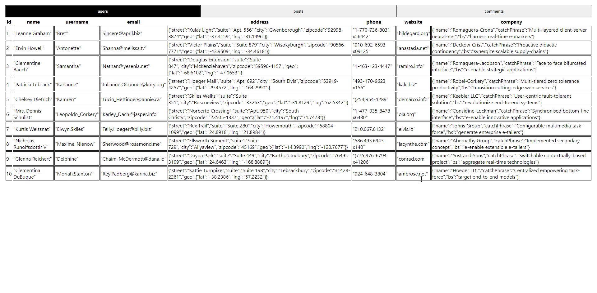
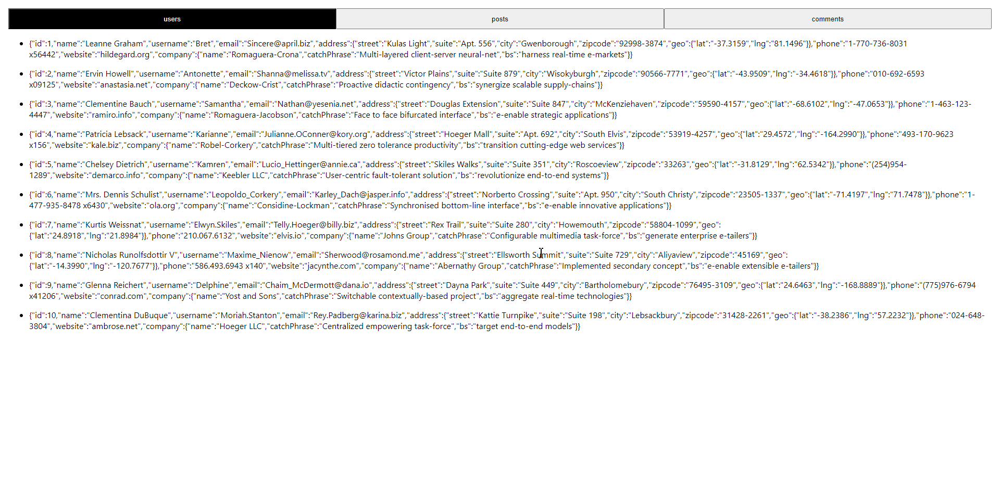

## React challenge to fetch and display data
Uses jsonplaceholder.typicode.com to GET data.

Maps over the data to display it .

## Setup
To run the app locally, run
- npm install (to install dependencies)
- npm start (to run react)

### Current version

### Previous version

